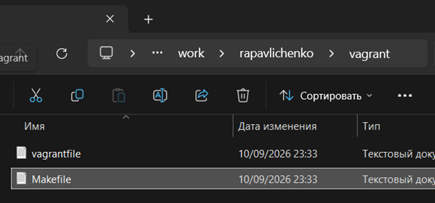
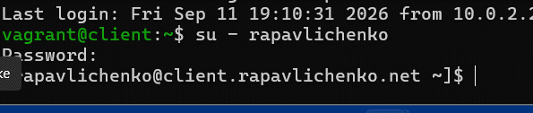
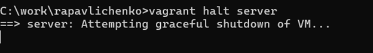

---
author:
  name: Павличенко Родион Андреевич
  email: 1132246838@rudn.ru
  affiliation:
    - name: Российский университет дружбы народов им. Патриса Лумумбы
      city: Москва
      country: Российская Федерация
title: "Лабораторная работа № 1"
subtitle: "Подготовка лабораторного стенда"
date: today
date-format: "YYYY-MM-DD"

format:
  beamer:
    pdf-engine: lualatex
    aspectratio: 169
    theme: default
    colortheme: default
    navigation: horizontal
    slide-level: 2
    toc: false
    number-sections: false
    incremental: false

    mainfont: "DejaVu Sans"
    sansfont: "DejaVu Sans"
    monofont: "DejaVu Sans Mono"

    latex-auto-install: false
    latex-tinytex: false

    include-in-header:
      text: |
        \setbeamercolor{normal text}{fg=black,bg=white}
        \setbeamercolor{structure}{fg=black}
        \setbeamercolor{title}{fg=black}
        \setbeamercolor{subtitle}{fg=black}
        \setbeamercolor{author}{fg=black}
        \setbeamercolor{date}{fg=black}
        \setbeamercolor{frametitle}{fg=black,bg=white}
        \setbeamercolor{itemize item}{fg=black}
        \setbeamercolor{itemize subitem}{fg=black}
        \setbeamercolor{enumerate item}{fg=black}
        \setbeamercolor{block title}{fg=black,bg=white}
        \setbeamercolor{block body}{fg=black,bg=white}
---

# Информация

## Докладчик

**Павличенко Родион Андреевич**

- студент Российского университета дружбы народов;
- группа НПИбд-02-24;
- электронная почта: 1132246838@rudn.ru;
- дисциплина: «Администрирование сетевых подсистем».

# Цель и задачи

## Цель работы

Получить практические навыки создания и подготовки виртуальных машин Rocky Linux с помощью Packer, VirtualBox и Vagrant.

## Основные задачи

- подготовить файлы проекта;
- собрать box-образ Rocky Linux;
- запустить машины `server` и `client`;
- проверить подключение по SSH;
- создать пользователя;
- назначить имена узлов;
- проверить работу стенда.

# Ход работы

## Подготовка файлов Packer

В каталоге `packer` были размещены:

- ISO-образ Rocky Linux;
- шаблон `vagrant-rocky.pkr.hcl`;
- файл автоматической установки `ks.cfg`.

::: columns
::: {.column width="50%"}

{width=95%}

:::
::: {.column width="50%"}

{width=95%}

:::
:::

## Подготовка Vagrant

В каталоге `vagrant` были подготовлены `Vagrantfile`, `Makefile` и сценарии provision.

::: columns
::: {.column width="50%"}

{width=95%}

:::
::: {.column width="50%"}

{width=95%}

:::
:::

## Сценарии настройки

Сценарии настройки были распределены по каталогам:

- `default` — общие настройки;
- `server` — настройка сервера;
- `client` — настройка клиента.

{width=70% fig-align="center"}

## Сборка образа Rocky Linux

Сборка образа была выполнена с помощью Packer:

```bash
packer init .
packer build vagrant-rocky.pkr.hcl
```

{width=80% fig-align="center"}

## Запуск лабораторного стенда

Виртуальные машины были запущены командами:

```bash
vagrant up server
vagrant up client
```

::: columns
::: {.column width="50%"}

**Сервер**

{width=96%}

:::
::: {.column width="50%"}

**Клиент**

{width=96%}

:::
:::

## Подключение к виртуальным машинам

Подключение к серверу и клиенту выполнялось по SSH средствами Vagrant.

::: columns
::: {.column width="50%"}

**Сервер**

{width=96%}

:::
::: {.column width="50%"}

**Клиент**

{width=96%}

:::
:::

## Проверка пользователя

На сервере был выполнен вход под пользователем `rapavlichenko`:

```bash
su - rapavlichenko
```

{width=78% fig-align="center"}

Появление нового приглашения командной строки подтвердило успешный вход.

## Настройка provision

В `Vagrantfile` были добавлены два общих сценария:

- `01-hostname.sh` — назначение имени узла;
- `01-user.sh` — создание пользователя.

{width=72% fig-align="center"}

# Результаты

## Проверка настроек клиента

После применения сценариев выполнен вход под пользователем `rapavlichenko`.

{width=78% fig-align="center"}

В приглашении командной строки появилось имя:

```text
rapavlichenko@client.rapavlichenko.net
```

Это подтвердило создание пользователя и назначение имени клиентского узла.

## Завершение работы

После проверки сервер был остановлен средствами Vagrant:

```bash
vagrant halt server
```

{width=78% fig-align="center"}

# Выводы

## Итоги работы

- подготовлены файлы Packer и Vagrant;
- собран box-образ Rocky Linux;
- запущены виртуальные машины `server` и `client`;
- проверено подключение к машинам по SSH;
- создан пользователь `rapavlichenko`;
- назначены имена виртуальных узлов;
- подтверждена работоспособность лабораторного стенда.

## {.unnumbered}

```{=latex}
\vfill

\begin{center}
{\Huge\bfseries Спасибо за внимание!}

\vspace{1cm}

{\Large Павличенко Родион Андреевич}

\vspace{0.3cm}

{\large НПИбд-02-24}
\end{center}

\vfill
```
