```{=latex}
\begin{titlepage}
\thispagestyle{fancy}

\begin{center}

{\large Российский университет дружбы народов имени Патриса Лумумбы}

\vspace{3cm}

{\LARGE\bfseries ОТЧЁТ}

\vspace{0.3cm}

{\LARGE\bfseries по лабораторной работе № 1}

\vspace{0.8cm}

{\LARGE\bfseries Подготовка лабораторного стенда}

\vspace{2.5cm}

\renewcommand{\arraystretch}{1.6}

\begin{tabularx}{\textwidth}{
    >{\bfseries\columncolor{tableblue}}p{0.25\textwidth}
    X
}
Дисциплина &
Администрирование сетевых подсистем \\

Выполнил &
Павличенко Родион Андреевич, НПИбд-02-24 \\

E-mail &
1132246838@rudn.ru \\
\end{tabularx}

\vfill

{\large Москва 2026}

\end{center}
\end{titlepage}

\setcounter{page}{2}
```

# Цель работы

Получить практические навыки создания и подготовки виртуальных машин Rocky Linux с помощью Packer, VirtualBox и Vagrant.

# Задание

1. Подготовить файлы проекта для сборки образа Rocky Linux.
2. Сформировать box-образ Rocky Linux для VirtualBox.
3. Запустить виртуальные машины `server` и `client`.
4. Проверить возможность подключения к созданным машинам.
5. Добавить административного пользователя и назначить имена узлов.
6. Проверить применение сценариев настройки.
7. Остановить виртуальные машины после завершения работы.

# Теоретические сведения

Vagrant используется для создания и управления воспроизводимыми виртуальными средами. Параметры лабораторного стенда задаются в файле `Vagrantfile`.

Packer предназначен для автоматической сборки образов операционных систем. В этой работе он используется для создания box-образа Rocky Linux.

VirtualBox выступает провайдером виртуализации. В нём запускаются виртуальные машины `server` и `client`.

Автоматическая установка Rocky Linux выполняется с помощью Kickstart-файла `ks.cfg`. Дополнительные настройки машин выполняются сценариями из каталога `provision`.

# Выполнение работы

## 1. Подготовка программного обеспечения

Для выполнения работы были установлены Packer и файловый менеджер FAR.

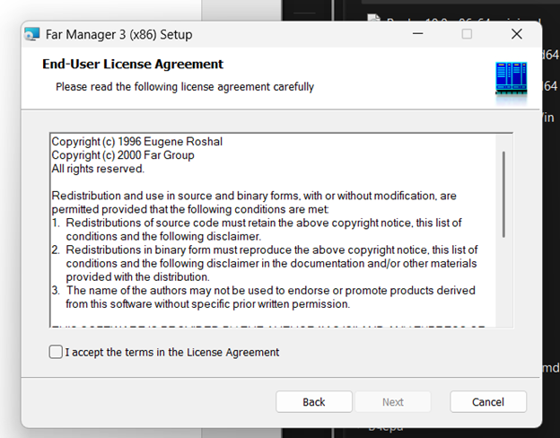{#fig-software width=85%}

## 2. Подготовка каталога Packer

В каталоге `packer` были размещены ISO-образ Rocky Linux и файл `vagrant-rocky.pkr.hcl`.

Файл `vagrant-rocky.pkr.hcl` содержит параметры виртуальной машины, сведения об исходном образе и порядок формирования box-файла.

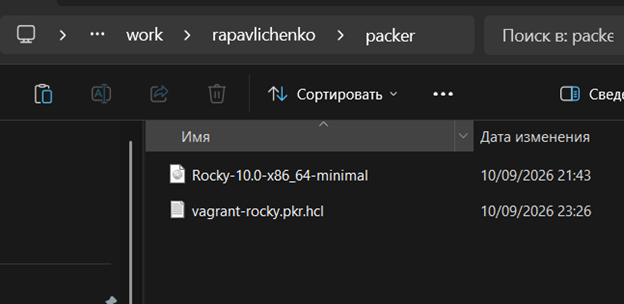{#fig-packer-directory width=85%}

## 3. Подготовка Kickstart-файла

В каталоге `packer/http` был размещён файл `ks.cfg`.

Этот файл используется для автоматической установки Rocky Linux и содержит основные параметры создаваемой системы.

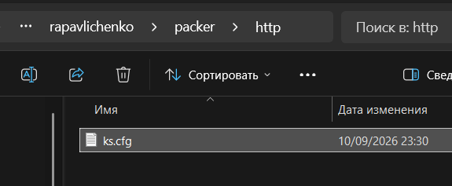{#fig-kickstart width=85%}

## 4. Подготовка файлов Vagrant

В каталоге `vagrant` были подготовлены файлы `Vagrantfile` и `Makefile`.

В `Vagrantfile` описываются виртуальные машины лабораторного стенда. В `Makefile` находятся команды, упрощающие работу с проектом.

{#fig-vagrant-directory width=85%}

## 5. Подготовка сценариев provision

Сценарии автоматической настройки были распределены по каталогам `default`, `server` и `client`.

Каталог `default` содержит общие настройки. В каталогах `server` и `client` находятся сценарии, предназначенные для соответствующих виртуальных машин.

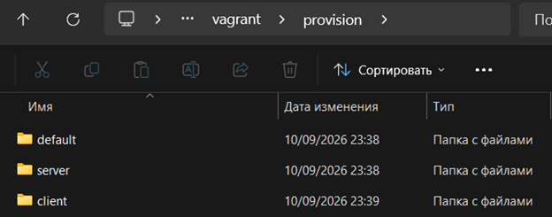{#fig-provision-directory width=85%}

В общем каталоге `default` были размещены сценарии создания пользователя и назначения имени узла.

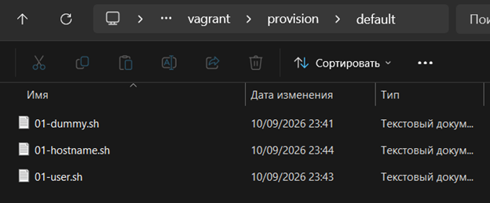{#fig-default-scripts width=85%}

## 6. Сборка образа Rocky Linux

После подготовки файлов была запущена сборка образа Rocky Linux с помощью Packer.

Для сборки использовались команды:

```bash
packer init .
packer build vagrant-rocky.pkr.hcl
```

Packer создал виртуальную машину VirtualBox и начал автоматическую установку операционной системы.

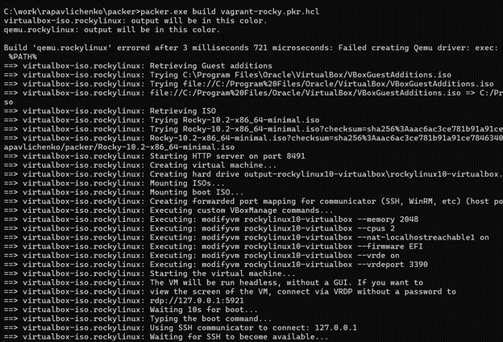{#fig-packer-build width=92%}

Результатом выполнения этого этапа стал box-файл Rocky Linux, предназначенный для дальнейшего использования средствами Vagrant.

## 7. Запуск виртуальной машины server

После добавления box-файла была запущена виртуальная машина `server`.

Для запуска использовалась команда:

```bash
vagrant up server
```

Vagrant импортировал подготовленный образ, создал виртуальную машину и настроил её сетевые интерфейсы.

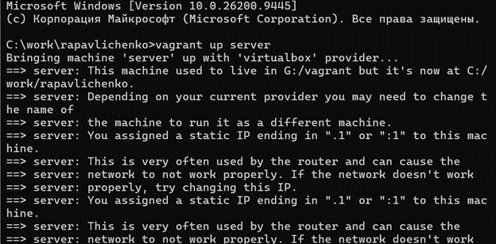{#fig-server-start width=92%}

## 8. Запуск виртуальной машины client

После запуска сервера была запущена виртуальная машина `client`.

```bash
vagrant up client
```

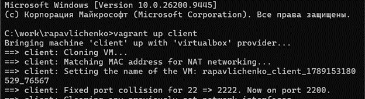{#fig-client-start width=92%}

После выполнения команд обе виртуальные машины лабораторного стенда находились в запущенном состоянии.

## 9. Подключение к серверу

Для проверки работы сервера было выполнено подключение по SSH.

```bash
vagrant ssh server
```

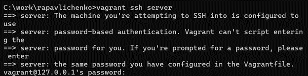{#fig-server-ssh width=92%}

После подключения был выполнен вход под пользователем `rapavlichenko`.

```bash
su - rapavlichenko
```

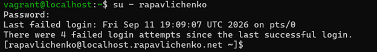{#fig-server-user width=92%}

Появление приглашения командной строки пользователя `rapavlichenko` подтвердило успешный вход в систему.

После проверки был выполнен выход из пользовательского сеанса.

```bash
exit
```

{#fig-server-exit width=92%}

## 10. Подключение к клиенту

Для проверки клиентской машины было выполнено подключение по SSH.

```bash
vagrant ssh client
```

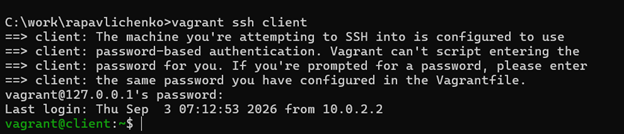{#fig-client-ssh width=92%}

Подключение к клиентской машине было выполнено успешно.

## 11. Первоначальная остановка сервера

После проверки была выполнена команда остановки сервера:

```bash
vagrant halt server
```

Vagrant не смог выполнить штатное завершение работы гостевой системы, поэтому виртуальная машина была выключена принудительно.

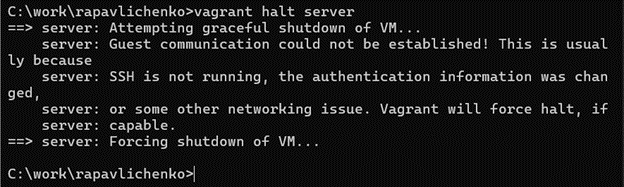{#fig-server-first-halt width=92%}

## 12. Настройка пользователя и имён узлов

В файл `Vagrantfile` были добавлены два общих блока provision.

Сценарий `01-hostname.sh` назначает имя узла. Сценарий `01-user.sh` создаёт административного пользователя.

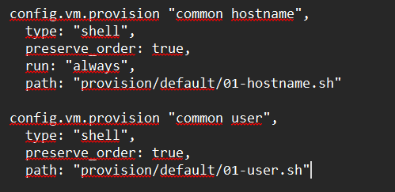{#fig-vagrant-provision width=85%}

## 13. Проверка настроек клиента

После применения сценариев настройки на клиентской машине был выполнен вход под пользователем `rapavlichenko`.

```bash
su - rapavlichenko
```

В приглашении командной строки отобразилось имя:

```text
rapavlichenko@client.rapavlichenko.net
```

Это подтверждает успешное создание пользователя и правильное назначение имени клиентскому узлу.

{#fig-client-user width=92%}

Повторная проверка показала, что параметры клиентской машины были Benn... Wait need finish. 

# Ответы на контрольные вопросы

## Для чего предназначен Vagrant?

Vagrant предназначен для автоматизированного создания, настройки и управления виртуальными машинами. Конфигурация виртуального стенда хранится в текстовом файле, поэтому его можно повторно развернуть с такими же параметрами.

## Что такое box-файл и Vagrantfile?

Box-файл представляет собой подготовленный образ виртуальной машины с метаданными, необходимыми Vagrant.

`Vagrantfile` содержит описание лабораторного стенда: используемый box-образ, виртуальные машины, объём памяти, сетевые интерфейсы, имена узлов и сценарии автоматической настройки.

## Какие основные команды Vagrant использовались в работе?

Запуск виртуальной машины:

```bash
vagrant up server
vagrant up client
```

Просмотр состояния машин:

```bash
vagrant status
```

Подключение по SSH:

```bash
vagrant ssh server
vagrant ssh client
```

Применение сценариев настройки:

```bash
vagrant provision
```

Остановка виртуальных машин:

```bash
vagrant halt
```

Удаление созданных машин:

```bash
vagrant destroy
```

## Для чего нужны конфигурационные файлы лабораторной работы?

Файл `vagrant-rocky.pkr.hcl` описывает процесс сборки образа Rocky Linux с помощью Packer. В нём задаются исходный ISO-образ, аппаратные параметры виртуальной машины, способ загрузки и порядок формирования box-файла.

Файл `ks.cfg` содержит параметры автоматической установки Rocky Linux: язык, раскладку клавиатуры, часовой пояс, параметры диска, пользователей и устанавливаемые пакеты.

Файл `Vagrantfile` описывает виртуальные машины `server` и `client`, их аппаратные параметры, сетевые интерфейсы и сценарии provision.

Файл `Makefile` содержит команды, которые упрощают сборку образа и управление лабораторным стендом.

# Выводы

В ходе лабораторной работы был подготовлен стенд из двух виртуальных машин с операционной системой Rocky Linux.

С помощью Packer был собран базовый box-образ. Средствами Vagrant были запущены виртуальные машины `server` и `client`, после чего была проверена возможность подключения к ним по SSH.

В конфигурацию были добавлены сценарии создания пользователя `rapavlichenko` и назначения имён узлов. Появление приглашения `rapavlichenko@client.rapavlichenko.net` подтвердило правильное применение настроек.

Поставленная цель была достигнута. Подготовленный стенд можно использовать при выполнении следующих лабораторных работ.
