---
# Preamble

author:
  name: Павличенко Родион Андреевич
  email: 1132246838@rudn.ru
  affiliation:
    - name: Российский университет дружбы народов им. Патриса Лумумбы
      country: Российская Федерация
      postal-code: 117198
      city: Москва
      address: ул. Миклухо-Маклая, д. 6

title: Лабораторная работа № 2
subtitle: Настройка DNS-сервера
license: CC BY
date: today

lang: ru-RU
crossref:
  lof-title: Список иллюстраций
  lot-title: Список таблиц
  lol-title: Листинги

format:
  beamer:
    pdf-engine: xelatex
    mainfont: "DejaVu Serif"
    sansfont: "DejaVu Sans"
    monofont: "DejaVu Sans Mono"
    toc: true
    toc-title: Содержание
    number-sections: true
    colorlinks: false
    toc-depth: 2
    slide_level: 2
    aspectratio: 169
    section-titles: true
    theme: metropolis
    themeoptions: progressbar=frametitle,sectionpage=progressbar,numbering=fraction
    babel-lang: russian
    babel-otherlangs: english
  revealjs:
    transition: slide
    margin: 0.2
    smaller: false
    output-ext: html
    theme: beige
    logo: _resources/image/logo_rudn.png
---

# Информация

## Докладчик

:::::::::::::: {.columns align=center}
::: {.column width="70%"}

* Павличенко Родион Андреевич
* Студент
* Группа НПИбд-02-24
* Российский университет дружбы народов им. Патриса Лумумбы
* [1132246838@rudn.ru](mailto:1132246838@rudn.ru)

:::
::: {.column width="30%"}

:::
::::::::::::::

# Цель и задание

## Цель работы

Получить практические навыки установки и настройки DNS-сервера BIND, создания прямой и обратной зон, проверки разрешения доменных имён и автоматизации конфигурации серверной виртуальной машины средствами Vagrant.

## Основные задачи

* установить и настроить BIND;
* создать прямую и обратную зоны;
* настроить NetworkManager, firewalld и SELinux;
* проверить DNS с помощью `dig` и `host`;
* автоматизировать настройку в Vagrant.

# Выполнение лабораторной работы

## Подготовка виртуальной машины

:::::::::::::: {.columns align=center}
::: {.column width="50%"}
Запущена виртуальная машина `server`.

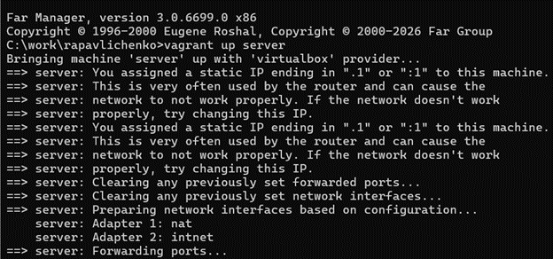{width=100%}
:::
::: {.column width="50%"}
Выполнено подключение по SSH.

{width=100%}
:::
::::::::::::::

## Переход к административной работе

:::::::::::::: {.columns align=center}
::: {.column width="50%"}
Выполнен вход под пользователем `rapavlichenko`.

{width=100%}
:::
::: {.column width="50%"}
Получены полномочия суперпользователя.

{width=100%}
:::
::::::::::::::

## Установка BIND

Установлены пакеты `bind` и `bind-utils`, содержащие DNS-сервер и диагностические утилиты.

{width=85%}

## Проверка исходной работы DNS

Команда `dig` вернула A-записи внешнего узла. Одновременно выявлен недоступный DNS-сервер `172.19.0.2`.

{width=80%}

## Основные файлы конфигурации

:::::::::::::: {.columns align=center}
::: {.column width="50%"}
`/etc/resolv.conf` задаёт используемые DNS-серверы.

{width=100%}
:::
::: {.column width="50%"}
`/etc/named.conf` задаёт параметры BIND.

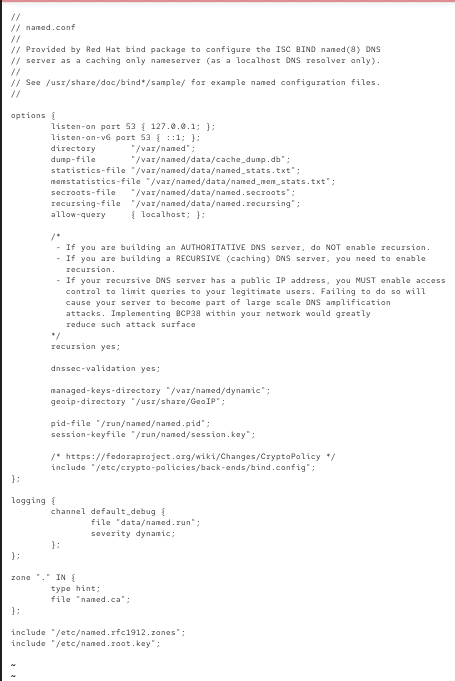{width=92%}
:::
::::::::::::::

## Шаблоны файлов зон

:::::::::::::: {.columns align=center}
::: {.column width="50%"}
Шаблон прямой локальной зоны.

{width=100%}
:::
::: {.column width="50%"}
Шаблон обратной локальной зоны.

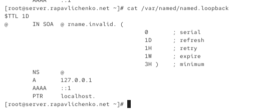{width=100%}
:::
::::::::::::::

## Корневые DNS-серверы

Файл `named.ca` содержит адреса корневых DNS-серверов, с которых начинается рекурсивное разрешение имён.

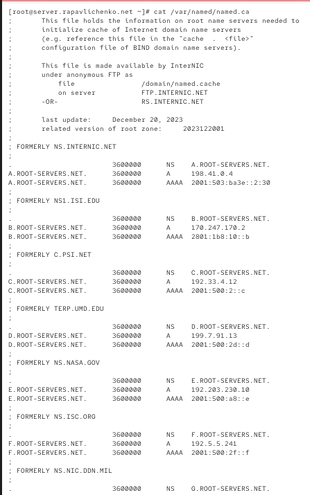{width=52%}

## Первый запуск и диагностика

:::::::::::::: {.columns align=center}
::: {.column width="45%"}
Служба `named` была запущена.

{width=100%}
:::
::: {.column width="55%"}
Проверка показала, что локальный DNS ещё не используется системой.

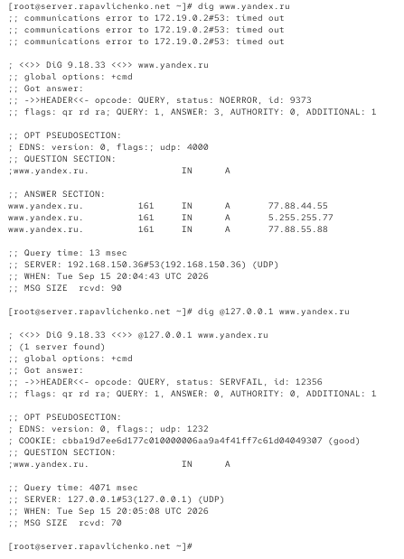{width=85%}
:::
::::::::::::::

## Открытие профиля eth0

:::::::::::::: {.columns align=center}
::: {.column width="50%"}
Запущен интерактивный редактор NetworkManager.

{width=100%}
:::
::: {.column width="50%"}
Выбран профиль подключения `eth0`.

{width=100%}
:::
::::::::::::::

## Изменение DNS в NetworkManager

Удалены автоматически полученные DNS-серверы, включён `ignore-auto-dns` и задан адрес `127.0.0.1`.

{width=82%}

## Настройка локального DNS

Для профиля `eth0` отключено получение DNS по DHCP и задан локальный сервер `127.0.0.1`.

{width=88%}

## Проверка resolv.conf

После перезапуска NetworkManager локальный DNS-сервер появился в `/etc/resolv.conf`.

{width=82%}

## Настройка BIND и firewalld

:::::::::::::: {.columns align=center}
::: {.column width="55%"}
Разрешены запросы из локальной сети.

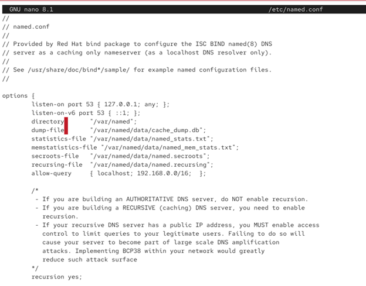{width=95%}
:::
::: {.column width="45%"}
В firewalld разрешена служба DNS.

{width=100%}
:::
::::::::::::::

## Проверка сетевого порта

Командой `lsof` проверено использование UDP-портов. Служба DNS использует порт 53.

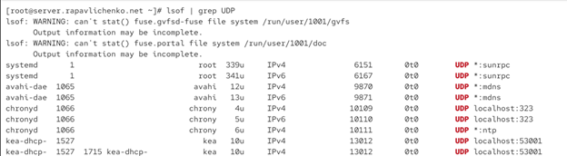{width=88%}

## Подготовка пользовательского файла зон

:::::::::::::: {.columns align=center}
::: {.column width="50%"}
Скопирован файл примеров зон.

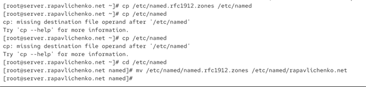{width=100%}
:::
::: {.column width="50%"}
Файл зон подключён в `named.conf`.

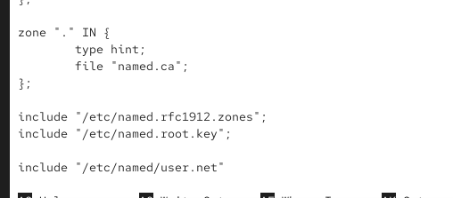{width=80%}
:::
::::::::::::::

## Описание зон

В конфигурацию подключены прямая зона `rapavlichenko.net` и обратная зона `1.168.192.in-addr.arpa`.

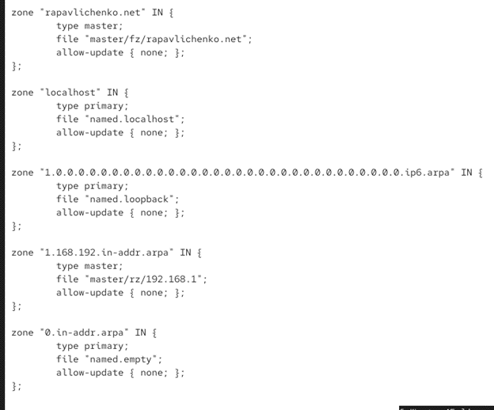{width=55%}

## Каталоги файлов зон

Созданы каталоги `master/fz` для прямых зон и `master/rz` для обратных зон.

{width=82%}

## Подготовка прямой зоны

Шаблон `named.localhost` скопирован в каталог прямых зон и переименован в `rapavlichenko.net`.

{width=82%}

## Прямая зона

Созданы SOA- и NS-записи, а также A-записи узлов `server` и `ns` с адресом `192.168.1.1`.

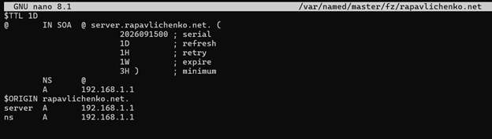{width=78%}

## Подготовка обратной зоны

Шаблон `named.loopback` скопирован в каталог обратных зон и переименован в `192.168.1`.

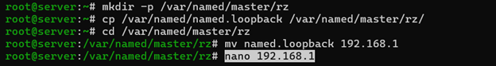{width=82%}

## Обратная зона

PTR-записи связывают адрес `192.168.1.1` с именами `server.rapavlichenko.net` и `ns.rapavlichenko.net`.

{width=68%}

## Настройка SELinux

Восстановлены контексты файлов и включён параметр `named_write_master_zones`.

:::::::::::::: {.columns align=center}
::: {.column width="50%"}
{width=100%}
:::
::: {.column width="50%"}
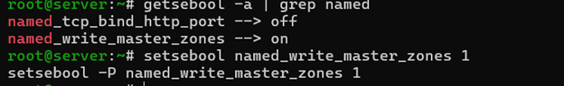{width=100%}
:::
::::::::::::::

## Проверка системного журнала

В журнале systemd проверена работа служб после изменения конфигурации.

{width=85%}

## Запуск DNS-сервера

Служба `named` перезапущена и перешла в состояние `active`.

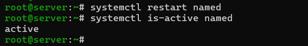{width=82%}

# Результаты

## Проверка прямой зоны

Команда `dig ns.rapavlichenko.net` вернула авторитетный ответ `192.168.1.1`.

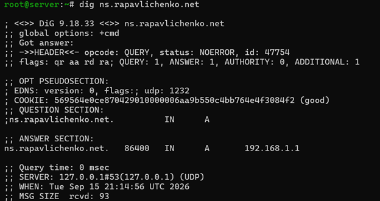{width=82%}

## Проверка записей зоны

Команды `host` подтвердили работу A-, NS-, SOA- и PTR-записей.

{width=82%}

# Автоматизация

## Сохранение рабочей конфигурации

Файлы BIND и зоны скопированы в каталог `provision/server/dns` для последующего автоматического развёртывания.

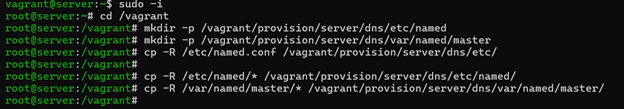{width=82%}

## Сценарий настройки DNS

Сценарий `dns.sh` устанавливает пакеты, размещает конфигурацию, настраивает права, SELinux, firewalld и NetworkManager, затем запускает `named`.

{width=52%}

## Подключение сценария в Vagrantfile

Provisioner `server dns` запускает сценарий при развёртывании серверной виртуальной машины.

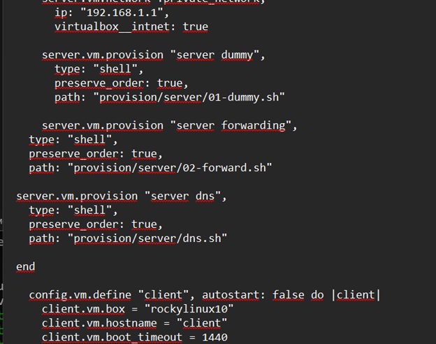{width=58%}

# Выводы

## Выводы

В ходе работы были получены практические навыки установки и настройки DNS-сервера BIND. Были созданы прямая и обратная зоны, настроены сетевые параметры, firewalld и SELinux, проверено разрешение имён и подготовлена автоматизация конфигурации сервера средствами Vagrant.

# Завершение

## {.plain}

```{=latex}
\vfill
\begin{center}
{\Huge Спасибо за внимание}
\end{center}
\vfill
```
