---
# Preamble

## Author
author:
  name: Павличенко Родион Андреевич
  email: 1132246838@rudn.ru
  affiliation:
    - name: Российский университет дружбы народов им. Патриса Лумумбы
      country: Российская Федерация
      postal-code: 117198
      city: Москва
      address: ул. Миклухо-Маклая, д. 6
## Title
title: "Лабораторная работа № 2"
subtitle: "Настройка DNS-сервера"
license: "CC BY"
## Generic options
lang: ru-RU
number-sections: true
toc: true
toc-title: "Содержание"
toc-depth: 2
## Crossref customization
crossref:
  lof-title: "Список иллюстраций"
  lot-title: "Список таблиц"
  lol-title: "Листинги"
## Bibliography
bibliography:
  - bib/cite.bib
csl: _resources/csl/gost-r-7-0-5-2008-numeric.csl
## Formats
format:
  pdf:
    toc: true
    number-sections: true
    colorlinks: false
    toc-depth: 2
    lof: true
    lot: true
    documentclass: scrreprt
    papersize: a4
    fontsize: 12pt
    linestretch: 1.5
    babel-lang: russian
    babel-otherlangs: english
    cite-method: biblatex
    biblio-style: gost-numeric
    biblatexoptions:
      - backend=biber
      - langhook=extras
      - autolang=other*
    csquotes: true
    indent: true
    header-includes: |
      \usepackage{indentfirst}
      \usepackage{float}
      \floatplacement{figure}{H}
      \usepackage[math,RM={Scale=0.94},SS={Scale=0.94},SScon={Scale=0.94},TT={Scale=MatchLowercase,FakeStretch=0.9},DefaultFeatures={Ligatures=Common}]{plex-otf}
  docx:
    toc: true
    number-sections: true
    toc-depth: 2
---

# Цель работы

Получить практические навыки установки и настройки DNS-сервера BIND, создания прямой и обратной зон, проверки разрешения доменных имён и автоматизации конфигурации серверной виртуальной машины средствами Vagrant.

# Задание

1. Установить пакеты BIND и изучить основные конфигурационные файлы DNS-сервера.
2. Настроить локальный DNS-сервер и сетевые параметры серверной виртуальной машины.
3. Создать прямую зону `rapavlichenko.net` и обратную зону для сети `192.168.1.0/24`.
4. Настроить права доступа, контексты и логические параметры SELinux, а также разрешить службу DNS в межсетевом экране.
5. Проверить прямое и обратное разрешение имён средствами `dig` и `host`.
6. Подготовить сценарий автоматической настройки DNS-сервера и подключить его в `Vagrantfile`.

# Выполнение лабораторной работы

## Подготовка серверной виртуальной машины

В каталоге проекта была запущена серверная виртуальная машина командой `vagrant up server`.

{#fig-201 width=90%}

После запуска выполнено подключение к серверу по SSH.

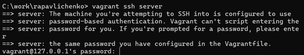{#fig-202 width=90%}

Для дальнейшей работы выполнен переход в учётную запись `rapavlichenko`.

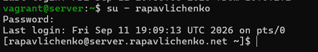{#fig-203 width=90%}

Получены полномочия суперпользователя для настройки системных служб.

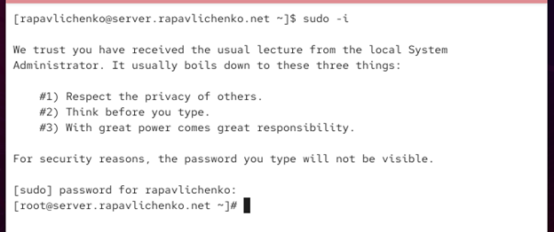{#fig-204 width=90%}

Установлены пакеты `bind` и `bind-utils`, содержащие DNS-сервер BIND и диагностические утилиты.

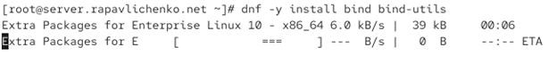{#fig-205 width=90%}

## Исследование исходной конфигурации DNS

Командой `dig www.yandex.ru` проверена текущая работа DNS. Первый сервер из списка не отвечал, после чего запрос был успешно обработан доступным DNS-сервером и вернул A-записи узла.

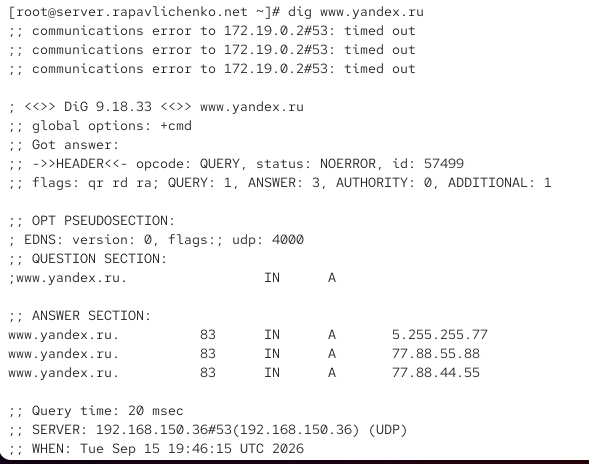{#fig-206 width=90%}

В файле `/etc/resolv.conf` изучены поисковый домен и последовательность DNS-серверов, используемых системой.

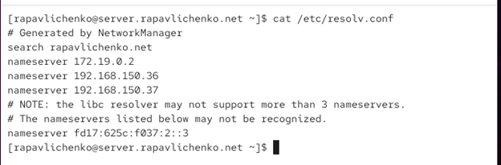{#fig-207 width=90%}

Рассмотрен основной конфигурационный файл `/etc/named.conf`. В нём задаются адреса прослушивания, разрешённые клиенты, рекурсия, DNSSEC и подключаемые файлы зон.

{#fig-208 width=55%}

Изучен файл корневых серверов `/var/named/named.ca`, который используется BIND для выполнения рекурсивных запросов начиная с корневой зоны DNS.

{#fig-209 width=45%}

Файл `/var/named/named.localhost` рассмотрен как пример прямой локальной зоны.

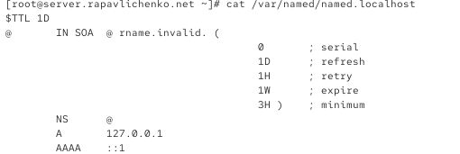{#fig-210 width=90%}

Файл `/var/named/named.loopback` рассмотрен как пример обратной зоны с PTR-записью.

{#fig-211 width=90%}

Служба `named` была запущена для проверки базовой конфигурации.

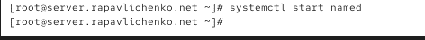{#fig-212 width=90%}

Повторный запрос `dig` показал, что системный DNS ещё не направлен на локальный сервер: внешний запрос выполнялся через вышестоящий сервер, а обращение к `127.0.0.1` завершалось ошибкой.

{#fig-213 width=58%}

## Настройка локального DNS и сетевого доступа

Для изменения параметров подключения был открыт интерактивный редактор NetworkManager `nmcli connection edit eth0`.

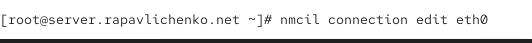{#fig-214 width=90%}

В редакторе выбрано существующее подключение `eth0`.

{#fig-215 width=90%}

Автоматически полученные DNS-серверы удалены, включён параметр `ipv4.ignore-auto-dns`, а в качестве DNS указан локальный адрес `127.0.0.1`.

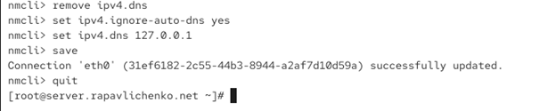{#fig-216 width=90%}

Изменения подключения сохранены и редактор закрыт.

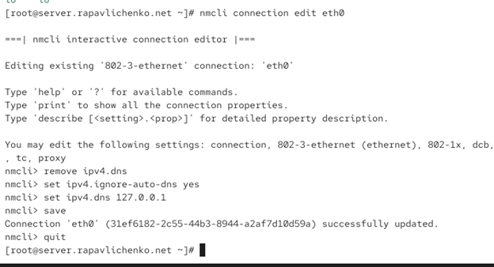{#fig-217 width=90%}

После перезапуска NetworkManager в `/etc/resolv.conf` появился локальный DNS-сервер `127.0.0.1`.

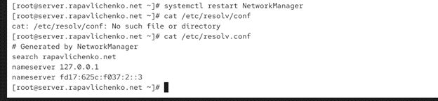{#fig-218 width=90%}

В `/etc/named.conf` сервер настроен на прослушивание нужных интерфейсов, а запросы разрешены для локального узла и сети `192.168.0.0/16`.

{#fig-219 width=90%}

В межсетевом экране служба DNS разрешена для текущей и постоянной конфигураций.

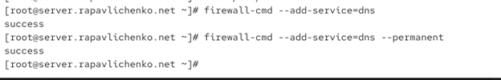{#fig-220 width=90%}

Командой `lsof` проверено использование UDP-портов. DNS-служба должна прослушивать порт 53.

{#fig-221 width=90%}

## Создание прямой и обратной DNS-зон

Файл с примерами зон `named.rfc1912.zones` скопирован в каталог `/etc/named` и переименован в `rapavlichenko.net`.

{#fig-222 width=90%}

Подключение пользовательского файла зон добавлено в основной файл `named.conf`.

{#fig-223 width=90%}

В пользовательском файле описаны прямая зона `rapavlichenko.net` и обратная зона `1.168.192.in-addr.arpa`.

{#fig-224 width=52%}

В каталоге `/var/named` созданы подкаталоги `master/fz` для прямых зон и `master/rz` для обратных зон.

{#fig-225 width=90%}

Шаблон `named.localhost` скопирован в каталог прямой зоны и переименован в `rapavlichenko.net`.

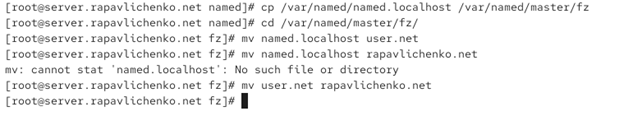{#fig-226 width=90%}

В файле прямой зоны определены SOA- и NS-записи, а также A-записи узлов `server` и `ns` с адресом `192.168.1.1`.

{#fig-227 width=90%}

Шаблон `named.loopback` скопирован в каталог обратной зоны и переименован в `192.168.1`.

{#fig-228 width=90%}

В обратной зоне добавлены PTR-записи, связывающие адрес `192.168.1.1` с именами `server.rapavlichenko.net` и `ns.rapavlichenko.net`.

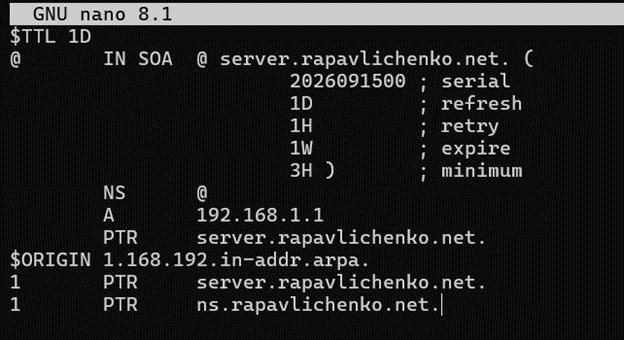{#fig-229 width=90%}

Для конфигурационных файлов восстановлены владельцы и контексты SELinux.

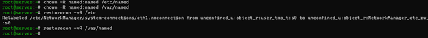{#fig-230 width=90%}

Проверен и включён логический параметр SELinux `named_write_master_zones`, разрешающий службе BIND работу с файлами мастер-зон.

{#fig-231 width=90%}

В журнале systemd проверена работа служб после изменения конфигурации.

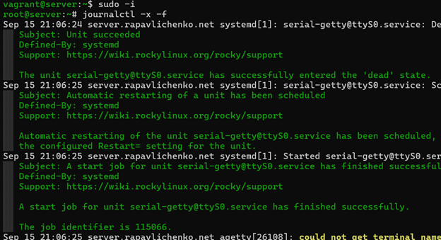{#fig-232 width=90%}

Служба `named` перезапущена. Команда `systemctl is-active named` подтвердила её активное состояние.

{#fig-233 width=90%}

## Проверка работы DNS-сервера

Команда `dig ns.rapavlichenko.net` вернула авторитетный ответ и адрес `192.168.1.1`, что подтвердило работу прямой зоны.

{#fig-234 width=90%}

Командами `host` проверены записи зоны и обратное преобразование адреса. Для `192.168.1.1` получены имена `server.rapavlichenko.net` и `ns.rapavlichenko.net`.

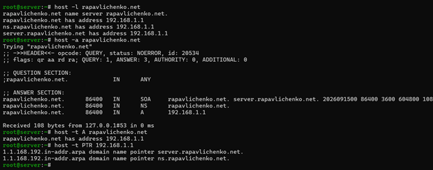{#fig-235 width=90%}

## Автоматизация настройки в Vagrant

Рабочая конфигурация BIND и файлы зон скопированы в каталог `provision/server/dns`, доступный Vagrant.

{#fig-236 width=90%}

Создан сценарий `dns.sh`, который устанавливает пакеты, копирует конфигурацию, настраивает права, SELinux, firewalld и NetworkManager, после чего запускает `named`.

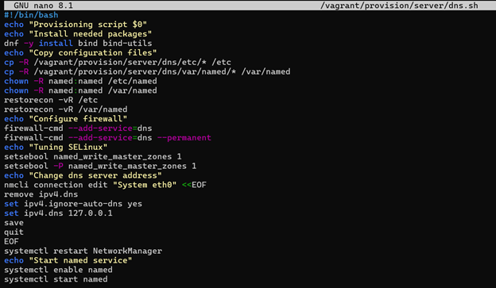{#fig-237 width=52%}

В `Vagrantfile` добавлен provisioner `server dns`, запускающий подготовленный сценарий при развёртывании серверной виртуальной машины.

{#fig-238 width=58%}

# Контрольные вопросы

## Что такое DNS

DNS — распределённая иерархическая система, преобразующая доменные имена в IP-адреса и выполняющая обратное преобразование адресов в имена.

## Зачем используется кэширование DNS-запросов

Кэширование сохраняет полученные ответы на время, указанное в TTL. Это сокращает задержку повторных запросов и уменьшает нагрузку на вышестоящие DNS-серверы.

## Чем отличаются прямая и обратная DNS-зоны

Прямая зона сопоставляет доменное имя с IP-адресом с помощью записей A и AAAA. Обратная зона сопоставляет IP-адрес с доменным именем с помощью записей PTR.

## Где хранятся основные файлы BIND

Основная конфигурация находится в `/etc/named.conf`, дополнительные описания зон — в `/etc/named`, а файлы данных зон обычно располагаются в `/var/named`.

## Что содержит файл resolv.conf

Файл `/etc/resolv.conf` содержит адреса используемых DNS-серверов в директивах `nameserver`, поисковый домен `search` и дополнительные параметры резолвера `options`.

## Основные типы ресурсных записей DNS

Запись A связывает имя с IPv4-адресом, AAAA — с IPv6-адресом, PTR — адрес с именем, NS определяет сервер зоны, SOA содержит основные параметры зоны, CNAME задаёт псевдоним, MX определяет почтовый сервер, TXT хранит текстовые данные, а SRV описывает расположение службы.

## Для чего используется домен in-addr.arpa

Домен `in-addr.arpa` используется для обратного разрешения IPv4-адресов в доменные имена посредством PTR-записей.

## Что представляет собой named

`named` — основной процесс DNS-сервера BIND. Он обслуживает зоны, принимает DNS-запросы, выполняет рекурсивное разрешение и кэширует ответы в соответствии с конфигурацией.

## Чем отличаются master- и slave-серверы

Master-сервер хранит редактируемую исходную копию зоны. Slave-сервер получает её копию с master-сервера посредством передачи зоны и обеспечивает резервирование.

## Основные параметры записи SOA

`serial` задаёт версию зоны, `refresh` — период проверки обновлений, `retry` — интервал повторной попытки, `expire` — срок допустимого использования зоны без связи с master-сервером, `minimum` — время отрицательного кэширования.

## Как ограничивают передачу зоны

Передача ограничивается директивой `allow-transfer`, в которой перечисляют разрешённые серверы. Дополнительно применяются TSIG-ключи и ограничения `allow-query` и `allow-recursion`.

## Какая запись используется для почтового сервера

Для назначения почтовых серверов домена используется запись MX. Она содержит приоритет и имя почтового узла.

## Как проверить DNS-зону

Для проверки применяются `dig`, `host`, `named-checkconf` и `named-checkzone`. `named-checkconf` проверяет общую конфигурацию, а `named-checkzone` — синтаксис и содержимое конкретной зоны.

## Как управлять службой named и просматривать журнал

Службой управляют командами `systemctl start`, `restart`, `stop` и `status named`. Диагностика выполняется командами `journalctl -xeu named` и `journalctl -x -f`.

## Как определить файлы, открытые процессом

Используются команды `lsof -p PID`, `lsof -c named` и просмотр каталога `/proc/PID/fd`.

## Как изменить DNS-сервер средствами nmcli

В профиле подключения включают `ipv4.ignore-auto-dns yes`, задают `ipv4.dns 127.0.0.1`, сохраняют профиль и повторно активируют соединение.

## Что такое SELinux и его контекст

SELinux реализует обязательный контроль доступа. Контекст SELinux содержит пользователя, роль, тип и уровень; именно тип объекта используется политиками для разрешения доступа системным службам.

## Как восстановить контекст и изменить логический параметр SELinux

Контексты восстанавливаются командой `restorecon -vR`. Логические параметры просматриваются через `getsebool`, а постоянное изменение выполняется командой `setsebool -P`, например `setsebool -P named_write_master_zones on`.

# Выводы

В ходе работы были получены практические навыки установки и настройки DNS-сервера BIND. Были созданы прямая зона `rapavlichenko.net` и обратная зона для сети `192.168.1.0/24`, настроены NetworkManager, firewalld и SELinux, а корректность разрешения имён подтверждена командами `dig` и `host`. Подготовленный сценарий `dns.sh` и его подключение в `Vagrantfile` позволили автоматизировать воспроизводимую настройку DNS-сервера.

# Список литературы{.unnumbered}

::: {#refs}
:::
