---
# Preamble

author:
  name: Павличенко Родион Андреевич
  email: 1132246838@rudn.ru
  affiliation:
    - name: Российский университет дружбы народов им. Патриса Лумумбы
      country: Российская Федерация
      postal-code: 117198
      city: Москва
      address: ул. Миклухо-Маклая, д. 6

title: Лабораторная работа № 3
subtitle: Настройка DHCP-сервера
license: CC BY
date: today

lang: ru-RU
crossref:
  lof-title: Список иллюстраций
  lot-title: Список таблиц
  lol-title: Листинги

format:
  beamer:
    pdf-engine: xelatex
    mainfont: "DejaVu Serif"
    sansfont: "DejaVu Sans"
    monofont: "DejaVu Sans Mono"
    toc: true
    toc-title: Содержание
    number-sections: true
    colorlinks: false
    toc-depth: 2
    slide_level: 2
    aspectratio: 169
    section-titles: true
    theme: metropolis
    themeoptions: progressbar=frametitle,sectionpage=progressbar,numbering=fraction
    babel-lang: russian
    babel-otherlangs: english
  revealjs:
    transition: slide
    margin: 0.2
    smaller: false
    output-ext: html
    theme: beige
    logo: _resources/image/logo_rudn.png
---

# Информация

## Докладчик

:::::::::::::: {.columns align=center}
::: {.column width="70%"}

* Павличенко Родион Андреевич
* Студент
* Группа НПИбд-02-24
* Российский университет дружбы народов им. Патриса Лумумбы
* [1132246838@rudn.ru](mailto:1132246838@rudn.ru)

:::
::: {.column width="30%"}

:::
::::::::::::::

# Цель и задание

## Цель работы

Приобрести практические навыки по установке и конфигурированию DHCP-сервера.

## Задание

* установить и настроить Kea DHCP на машине `server`;
* проверить выдачу сетевых параметров машине `client`;
* настроить динамическое обновление DNS-зон;
* проверить работу DHCP и DDNS;
* автоматизировать настройку средствами Vagrant.

# Настройка DHCP-сервера

## Запуск серверной машины

:::::::::::::: {.columns align=center}
::: {.column width="50%"}
Запущена виртуальная машина `server`.

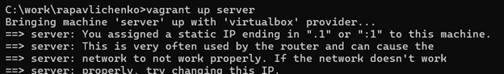{width=100%}
:::
::: {.column width="50%"}
Выполнено подключение по SSH.

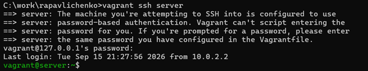{width=100%}
:::
::::::::::::::

## Получение административных прав

Получены полномочия суперпользователя для настройки системных служб.

{width=82%}

## Установка Kea DHCP

Установлен пакет DHCP-сервера Kea.

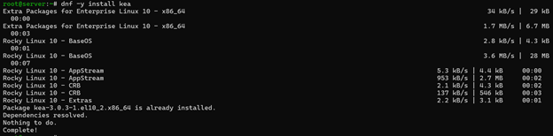{width=88%}

## Подготовка конфигурации

:::::::::::::: {.columns align=center}
::: {.column width="48%"}
Создана резервная копия исходной конфигурации.

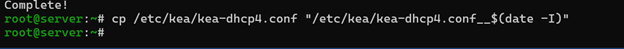{width=100%}
:::
::: {.column width="52%"}
Настроены подсеть, пул адресов, DNS и параметры аренды.

{width=72%}
:::
::::::::::::::

## Интерфейс и проверка конфигурации

:::::::::::::: {.columns align=center}
::: {.column width="45%"}
Сервер привязан к интерфейсу `eth1`.

{width=100%}
:::
::: {.column width="55%"}
Файл проверен средствами Kea.

{width=100%}
:::
::::::::::::::

## Автоматический запуск Kea

Служба `kea-dhcp4` включена в автозагрузку.

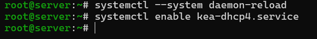{width=85%}

# Регистрация DHCP в DNS

## Записи прямой и обратной зон

:::::::::::::: {.columns align=center}
::: {.column width="50%"}
Добавлена A-запись `dhcp`.

{width=100%}
:::
::: {.column width="50%"}
Добавлена PTR-запись DHCP-сервера.

{width=100%}
:::
::::::::::::::

## Проверка имени DHCP-сервера

Имя `dhcp.rapavlichenko.net` разрешается в адрес `192.168.1.1`.

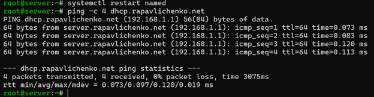{width=82%}

## Межсетевой экран и SELinux

:::::::::::::: {.columns align=center}
::: {.column width="52%"}
В `firewalld` разрешена служба DHCP.

{width=100%}
:::
::: {.column width="48%"}
Восстановлены контексты SELinux.

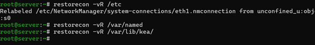{width=100%}
:::
::::::::::::::

## Запуск и наблюдение за службой

:::::::::::::: {.columns align=center}
::: {.column width="62%"}
Запущен просмотр системного журнала.

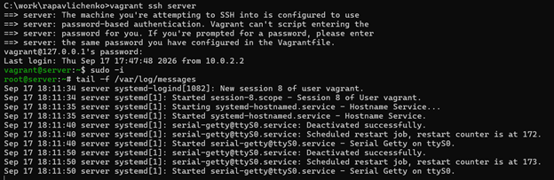{width=100%}
:::
::: {.column width="38%"}
Запущена служба `kea-dhcp4`.

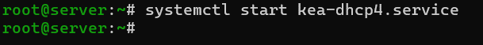{width=100%}
:::
::::::::::::::

# Настройка клиента

## Маршрутизация клиентской машины

Сценарий задаёт шлюз `192.168.1.1` на интерфейсе `eth1` и отключает маршрут по умолчанию через `eth0`.

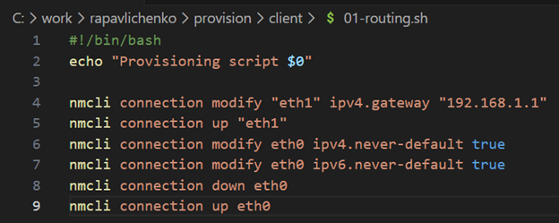{width=72%}

## Подключение сценария в Vagrant

В `Vagrantfile` добавлен provisioner `client routing`.

{width=72%}

## Запуск клиента

Клиентская машина запущена с повторным применением настроек.

{width=86%}

## Выдача адреса клиенту

Журнал Kea показывает запрос клиента, выделение адреса `192.168.1.30` и отправку DHCPACK.

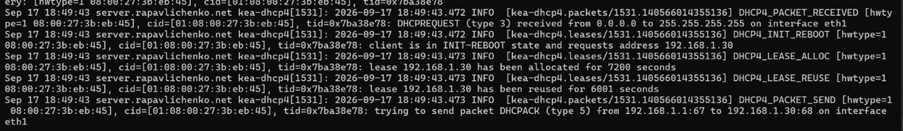{width=86%}

## Проверка интерфейсов

Интерфейс `eth1` получил адрес `192.168.1.30/24` из настроенного пула.

{width=72%}

## Файл аренд Kea

В `/var/lib/kea/kea-leases4.csv` записана активная аренда адреса `192.168.1.30`.

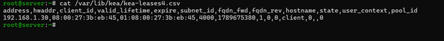{width=88%}

# Настройка DDNS

## Создание TSIG-ключа

:::::::::::::: {.columns align=center}
::: {.column width="50%"}
Создан ключ `DHCP_UPDATER`.

{width=100%}
:::
::: {.column width="50%"}
Проверено содержимое ключа.

{width=100%}
:::
::::::::::::::

## Права и подключение ключа

:::::::::::::: {.columns align=center}
::: {.column width="45%"}
Каталогу назначен владелец `named`.

{width=100%}
:::
::: {.column width="55%"}
Ключ подключён в `named.conf`.

{width=90%}
:::
::::::::::::::

## Разрешение обновления зон

В прямой и обратной зонах разрешены обновления, подписанные ключом `DHCP_UPDATER`.

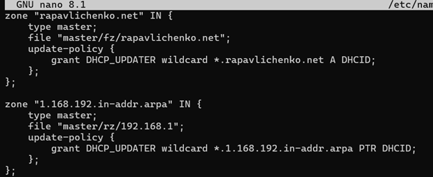{width=66%}

## Проверка BIND и подготовка Kea

Конфигурация BIND проверена, служба перезапущена, создан файл `/etc/kea/tsig-keys.json`.

{width=82%}

## Перенос TSIG-ключа

:::::::::::::: {.columns align=center}
::: {.column width="50%"}
Получен секрет созданного ключа.

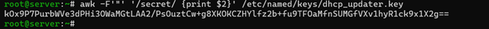{width=100%}
:::
::: {.column width="50%"}
Ключ сохранён в формате JSON.

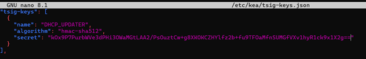{width=100%}
:::
::::::::::::::

## Защита файла ключа

Файлу назначен владелец `kea`, права доступа ограничены значением `640`.

{width=85%}

## Конфигурация Kea DDNS

Заданы параметры обновления прямой и обратной зон через DNS-сервер `192.168.1.1`.

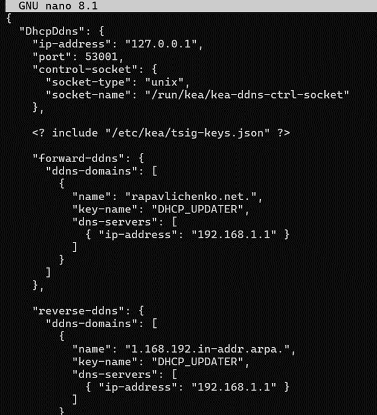{width=58%}

## Запуск службы DDNS

Конфигурация проверена, служба `kea-dhcp-ddns` включена и запущена.

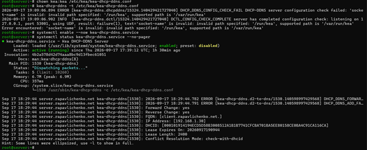{width=83%}

## Включение DDNS в DHCP

В `kea-dhcp4.conf` включены обновления и указан домен `rapavlichenko.net`.

{width=62%}

## Перезапуск DHCP-сервера

Журнал подтвердил успешную работу Kea после включения динамических обновлений.

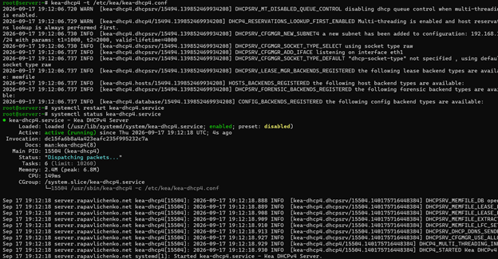{width=84%}

# Результаты

## Повторное получение адреса

Клиентское соединение `eth1` переподключено для обновления аренды и DNS-записи.

{width=85%}

## Журнал динамической зоны

Появление файла `.jnl` подтвердило принятие динамического обновления сервером BIND.

{width=82%}

## Проверка DNS-записи клиента

Команда `dig` вернула A-запись `client.rapavlichenko.net` с адресом `192.168.1.30`.

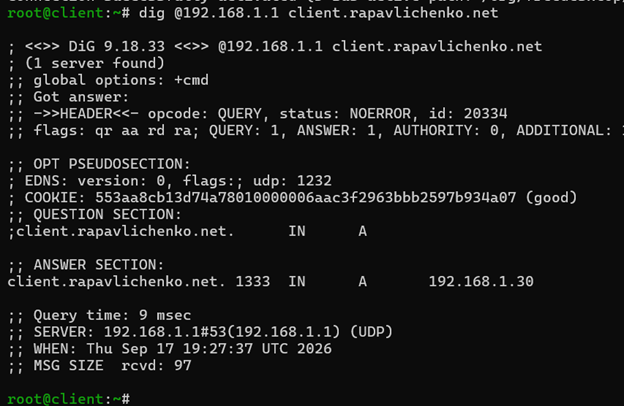{width=70%}

# Автоматизация

## Сохранение конфигурации DHCP

Рабочие файлы Kea скопированы в каталог `provision/server/dhcp`.

{width=85%}

## Обновление конфигурации DNS

Фактические файлы BIND скопированы в каталог автоматического развёртывания.

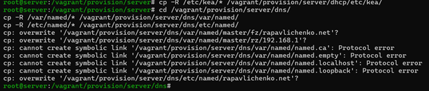{width=82%}

## Создание сценария dhcp.sh

В каталоге `provision/server` создан исполняемый сценарий настройки DHCP.

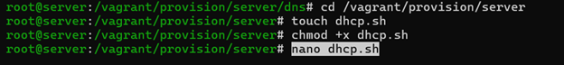{width=85%}

## Содержимое сценария

Сценарий устанавливает Kea, копирует конфигурацию, настраивает права, SELinux и `firewalld`, затем запускает службы DHCP и DDNS.

{width=58%}

## Подключение сценария к серверу

Provisioner `server dhcp` запускает сценарий после настройки DNS.

{width=58%}

## Завершение работы

После проверки клиентская и серверная виртуальные машины выключены.

{width=82%}

# Контрольные вопросы

## DHCP и сетевые подключения

* NetworkManager хранит профили в `/etc/NetworkManager/system-connections/`.
* DHCP автоматически выдаёт IP-адрес, маску, шлюз, DNS-серверы и срок аренды.
* Основной обмен выполняется сообщениями DHCPDISCOVER, DHCPOFFER, DHCPREQUEST и DHCPACK.
* Сервер использует UDP-порт 67, клиент — порт 68.

## Файлы Kea и DDNS

* `/etc/kea/kea-dhcp4.conf` содержит настройки DHCPv4.
* `/etc/kea/kea-dhcp-ddns.conf` задаёт взаимодействие с DNS.
* `/var/lib/kea/kea-leases4.csv` хранит сведения об арендах.
* DDNS автоматически создаёт и обновляет A- и PTR-записи.
* TSIG-ключ защищает запросы динамического обновления.

## Диагностические утилиты

* `ifconfig` показывает адреса, состояние и статистику интерфейсов.
* `ifconfig -a` выводит также отключённые интерфейсы.
* `ping -c 4 192.168.1.1` проверяет доступность четырьмя запросами.
* Итоговая статистика `ping` показывает задержку и потери пакетов.

# Выводы

## Выводы

В ходе работы были получены практические навыки установки и конфигурирования DHCP-сервера Kea. Сервер автоматически выдал клиенту сетевые параметры, а настройка DDNS обеспечила создание записи `client.rapavlichenko.net`. Сценарии Vagrant сохранили выполненную конфигурацию для повторного развёртывания стенда.

# Завершение

## {.plain}

```{=latex}
\vfill
\begin{center}
{\Huge Спасибо за внимание}
\end{center}
\vfill
```
