---
# Preamble

## Author
author:
  name: Павличенко Родион Андреевич
  email: 1132246838@rudn.ru
  affiliation:
    - name: Российский университет дружбы народов им. Патриса Лумумбы
      country: Российская Федерация
      postal-code: 117198
      city: Москва
      address: ул. Миклухо-Маклая, д. 6
## Title
title: "Лабораторная работа № 3"
subtitle: "Настройка DHCP-сервера"
license: "CC BY"
## Generic options
lang: ru-RU
number-sections: true
toc: true
toc-title: "Содержание"
toc-depth: 2
## Crossref customization
crossref:
  lof-title: "Список иллюстраций"
  lot-title: "Список таблиц"
  lol-title: "Листинги"
## Bibliography
bibliography:
  - bib/cite.bib
csl: _resources/csl/gost-r-7-0-5-2008-numeric.csl
## Formats
format:
  pdf:
    toc: true
    number-sections: true
    colorlinks: false
    toc-depth: 2
    lof: true
    lot: false
    documentclass: scrreprt
    papersize: a4
    fontsize: 12pt
    linestretch: 1.5
    babel-lang: russian
    babel-otherlangs: english
    cite-method: biblatex
    biblio-style: gost-numeric
    biblatexoptions:
      - backend=biber
      - langhook=extras
      - autolang=other*
    csquotes: true
    indent: true
    header-includes: |
      \usepackage{indentfirst}
      \usepackage{float}
      \floatplacement{figure}{H}
      \usepackage[math,RM={Scale=0.94},SS={Scale=0.94},SScon={Scale=0.94},TT={Scale=MatchLowercase,FakeStretch=0.9},DefaultFeatures={Ligatures=Common}]{plex-otf}
  docx:
    toc: true
    number-sections: true
    toc-depth: 2
---

# Цель работы

Приобрести практические навыки по установке и конфигурированию DHCP-сервера.

# Задание

1. Установить на виртуальной машине `server` DHCP-сервер.
2. Настроить виртуальную машину `server` в качестве DHCP-сервера для виртуальной внутренней сети.
3. Проверить корректность работы DHCP-сервера в виртуальной внутренней сети путём запуска виртуальной машины `client` и применения утилит диагностики.
4. Настроить обновление DNS-зоны при появлении в виртуальной внутренней сети новых узлов.
5. Проверить корректность работы DHCP-сервера и обновления DNS-зоны путём запуска виртуальной машины `client` и применения утилит диагностики.
6. Написать сценарий для Vagrant, фиксирующий действия по установке и настройке DHCP-сервера во внутреннем окружении виртуальной машины `server`, и внести соответствующие изменения в `Vagrantfile`.

# Выполнение лабораторной работы

## Установка и первоначальная настройка Kea DHCP

В каталоге проекта была запущена серверная виртуальная машина командой `vagrant up server`.

{#fig-301 width=90%}

После запуска выполнено подключение к серверу по SSH.

{#fig-302 width=90%}

Для настройки системных служб получены полномочия суперпользователя.

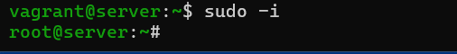{#fig-303 width=90%}

Установлен пакет DHCP-сервера Kea.

{#fig-304 width=90%}

Перед редактированием создана резервная копия исходного файла `/etc/kea/kea-dhcp4.conf`.

{#fig-305 width=90%}

В файле `/etc/kea/kea-dhcp4.conf` задан интерфейс `eth1`, настроена база аренд, указаны времена аренды, DNS-сервер, доменное имя и подсеть `192.168.1.0/24` с пулом адресов `192.168.1.30–192.168.1.199`.

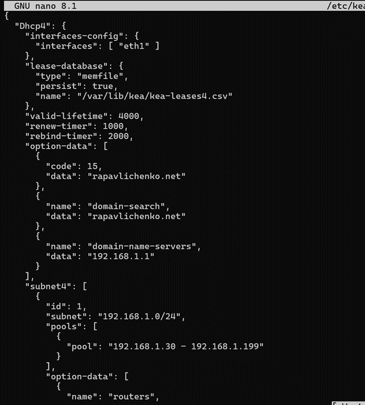{#fig-306 width=52%}

DHCP-сервер привязан к внутреннему сетевому интерфейсу `eth1`.

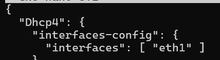{#fig-307 width=90%}

Конфигурация проверена средствами Kea. Результат подтвердил, что файл может быть прочитан сервером.

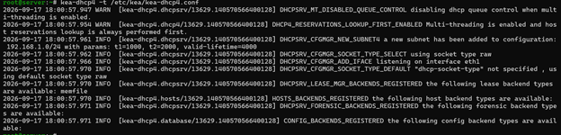{#fig-308 width=90%}

После изменения конфигурации выполнена перезагрузка параметров systemd и включён автоматический запуск службы `kea-dhcp4`.

{#fig-309 width=90%}

## Регистрация DHCP-сервера в DNS

В файл прямой зоны `rapavlichenko.net` добавлена A-запись `dhcp`, указывающая на адрес сервера `192.168.1.1`.

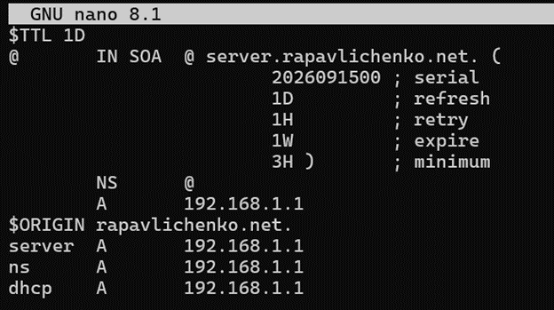{#fig-3101 width=90%}

В обратную зону добавлена PTR-запись для имени `dhcp.rapavlichenko.net`.

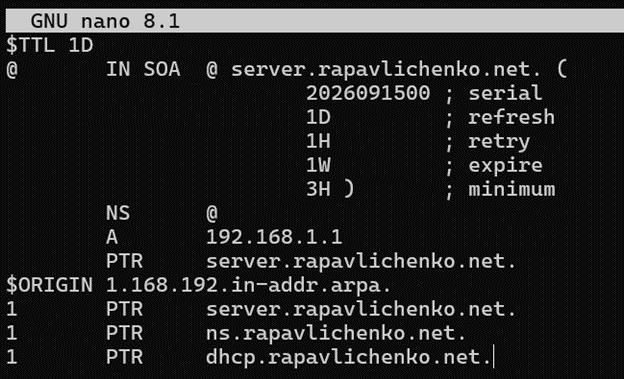{#fig-3102 width=90%}

После перезапуска BIND команда `ping dhcp.rapavlichenko.net` успешно преобразовала имя DHCP-сервера в адрес `192.168.1.1`.

{#fig-311 width=90%}

В межсетевом экране разрешена служба DHCP, а постоянная конфигурация `firewalld` обновлена.

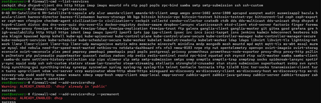{#fig-312 width=90%}

Для файлов конфигурации и данных Kea восстановлены корректные контексты SELinux.

{#fig-313 width=90%}

В отдельном терминале запущен просмотр системного журнала, позволяющий наблюдать обращения клиента и ответы DHCP-сервера.

{#fig-314 width=90%}

Служба `kea-dhcp4` была запущена.

{#fig-315 width=90%}

## Настройка клиентского узла

В сценарии `provision/client/01-routing.sh` для интерфейса `eth1` указан шлюз `192.168.1.1`, а для внешнего интерфейса отключено использование маршрута по умолчанию.

{#fig-316 width=75%}

В `Vagrantfile` подключён provisioner, запускающий сценарий маршрутизации клиентской машины.

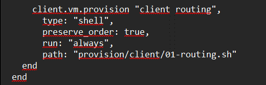{#fig-317 width=75%}

Клиентская виртуальная машина запущена с повторным применением настроек командой `vagrant up client --provision`.

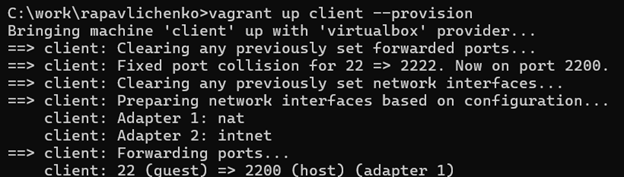{#fig-318 width=90%}

В журнале DHCP-сервера зафиксирован обмен с клиентом: сервер получил запрос, выделил адрес `192.168.1.30` и отправил подтверждение DHCPACK.

{#fig-319 width=90%}

Командой `ifconfig` проверены интерфейсы клиента. Интерфейс `eth1` получил адрес `192.168.1.30/24` из заданного пула.

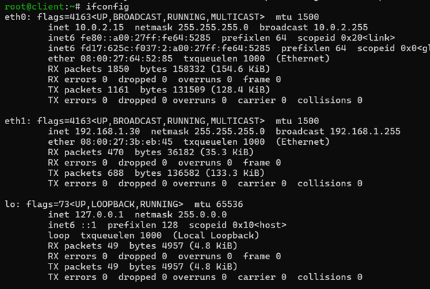{#fig-320 width=90%}

Файл `/var/lib/kea/kea-leases4.csv` содержит активную аренду адреса `192.168.1.30` клиенту с MAC-адресом `08:00:27:3b:eb:45`.

{#fig-321 width=90%}

## Настройка динамического обновления DNS

На сервере BIND создан каталог `/etc/named/keys`, после чего сгенерирован TSIG-ключ `dhcp_updater.key`.

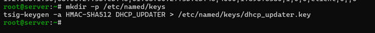{#fig-322 width=90%}

Содержимое созданного ключа просмотрено для дальнейшего подключения к BIND и Kea.

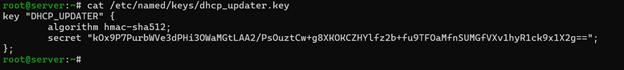{#fig-323 width=90%}

Для каталога с ключами назначен владелец `named`.

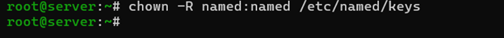{#fig-324 width=90%}

Файл ключа подключён в основной конфигурации `/etc/named.conf`.

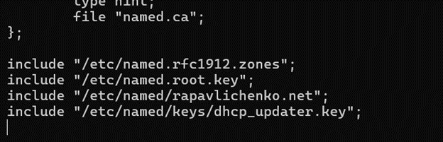{#fig-325 width=90%}

В описании прямой и обратной зон разрешены динамические обновления, подписанные ключом `DHCP_UPDATER`.

{#fig-326 width=70%}

Конфигурация BIND проверена командой `named-checkconf`, после чего служба `named` перезапущена. Для Kea подготовлен файл `/etc/kea/tsig-keys.json`.

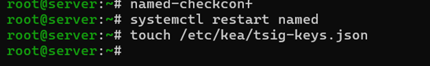{#fig-327 width=90%}

Секрет TSIG-ключа извлечён из конфигурации BIND.

{#fig-328 width=90%}

Ключ перенесён в JSON-файл Kea с указанием имени, алгоритма и секрета.

{#fig-329 width=90%}

Для файла ключа назначены владелец `kea` и права доступа `640`.

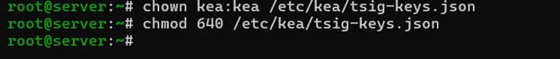{#fig-330 width=90%}

В `/etc/kea/kea-dhcp-ddns.conf` подключён файл TSIG-ключей и заданы параметры обновления прямой и обратной DNS-зон через сервер `192.168.1.1`.

{#fig-331 width=60%}

Конфигурация DDNS проверена, служба `kea-dhcp-ddns` запущена и включена в автозагрузку.

{#fig-332 width=90%}

В конфигурации DHCP включены DDNS-обновления, задан квалификатор доменного имени `rapavlichenko.net` и разрешено переопределение имени клиента.

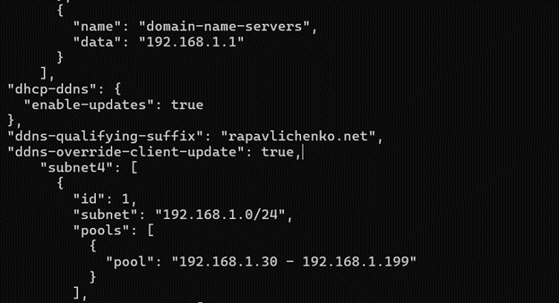{#fig-333 width=70%}

После проверки конфигурации DHCP-сервер перезапущен. Журнал подтвердил работу служб Kea и обработку запросов клиента.

{#fig-334 width=90%}

На клиенте соединение `eth1` переподключено, чтобы повторно получить адрес и инициировать динамическое обновление DNS.

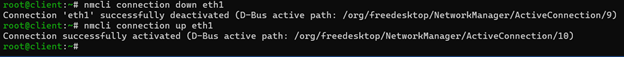{#fig-335 width=90%}

Появление журнального файла зоны подтвердило, что BIND принял динамическое обновление.

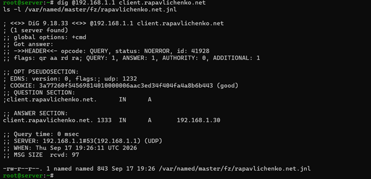{#fig-336 width=90%}

Команда `dig client.rapavlichenko.net` вернула A-запись `192.168.1.30`, автоматически созданную после выдачи аренды.

{#fig-337 width=90%}

## Автоматизация настройки DHCP и DDNS

В каталоге `/vagrant/provision/server` создана структура `dhcp/etc`, куда скопированы рабочие конфигурационные файлы Kea.

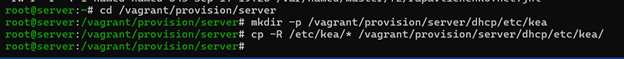{#fig-338 width=90%}

При копировании конфигурации DNS обнаружена символическая ссылка, которую нельзя было перенести напрямую в общий каталог. Вместо неё использованы фактические конфигурационные файлы.

{#fig-339 width=90%}

В каталоге `/vagrant/provision/server` создан исполняемый сценарий `dhcp.sh`.

{#fig-340 width=90%}

Сценарий устанавливает Kea, копирует конфигурацию, назначает владельцев и права, восстанавливает контексты SELinux, открывает DHCP в `firewalld` и запускает службы DHCP и DDNS.

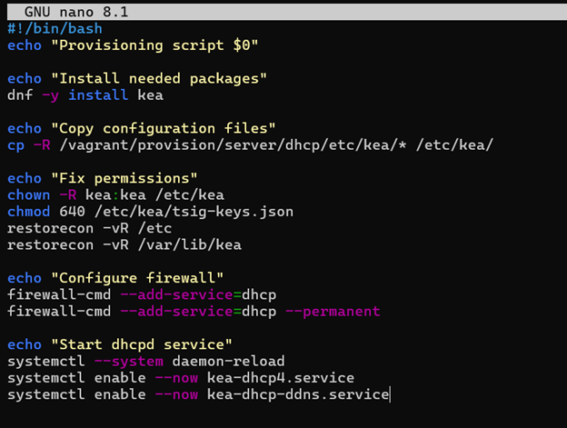{#fig-341 width=62%}

В `Vagrantfile` после настройки DNS подключён provisioner `server dhcp`, запускающий подготовленный сценарий при развёртывании сервера.

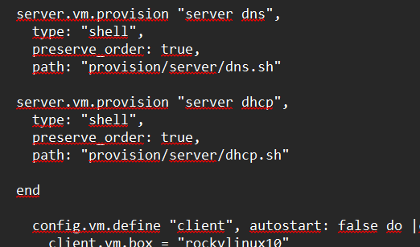{#fig-342 width=62%}

После завершения работы клиентская и серверная виртуальные машины были корректно выключены.

{#fig-343 width=90%}

# Контрольные вопросы

## В каких файлах хранятся настройки сетевых подключений

В современных системах семейства RHEL и Rocky Linux профили сетевых подключений хранятся в каталоге `/etc/NetworkManager/system-connections/`. Каждому подключению соответствует файл с расширением `.nmconnection`, содержащий параметры интерфейса, IP-адресации, шлюза и DNS. В старых версиях систем использовались файлы `/etc/sysconfig/network-scripts/ifcfg-*`. Текущая конфигурация DNS также отражается в `/etc/resolv.conf`.

## За что отвечает протокол DHCP

DHCP автоматически передаёт сетевому узлу IP-адрес, маску подсети, адрес основного шлюза, DNS-серверы, доменное имя и срок аренды. Централизованная выдача параметров упрощает администрирование и снижает вероятность конфликтов адресов.

## Как работает DHCP и какими сообщениями обмениваются клиент и сервер

Первоначальная настройка клиента обычно выполняется по схеме DORA. Клиент передаёт широковещательное сообщение DHCPDISCOVER, сервер отвечает предложением DHCPOFFER, клиент выбирает параметры сообщением DHCPREQUEST, а сервер подтверждает аренду сообщением DHCPACK. Также используются DHCPNAK для отклонения запроса, DHCPRELEASE для освобождения адреса, DHCPDECLINE для сообщения о конфликте и DHCPINFORM для запроса дополнительных параметров. Сервер использует UDP-порт 67, клиент — порт 68.

## В каких файлах находятся настройки DHCP-сервера

Основная конфигурация Kea DHCPv4 находится в `/etc/kea/kea-dhcp4.conf`, DHCPv6 — в `/etc/kea/kea-dhcp6.conf`. Параметры взаимодействия с DNS задаются в `/etc/kea/kea-dhcp-ddns.conf`, TSIG-ключи могут храниться в `/etc/kea/tsig-keys.json`. Сведения об арендах IPv4 записываются в `/var/lib/kea/kea-leases4.csv`, а об арендах IPv6 — в `/var/lib/kea/kea-leases6.csv`. Конфигурация управляющего агента находится в `/etc/kea/kea-ctrl-agent.conf`.

## Что такое DDNS и для чего он применяется

DDNS — механизм динамического обновления DNS-записей. После выдачи адреса DHCP-сервер может автоматически создать или изменить A- и PTR-записи клиента. Это поддерживает актуальность DNS в сети с динамической адресацией. Для проверки подлинности обновлений между Kea и BIND применяется TSIG-ключ.

## Какую информацию можно получить с помощью ifconfig

`ifconfig` показывает состояние интерфейса, IPv4- и IPv6-адреса, маску, широковещательный и MAC-адреса, а также статистику принятых и переданных пакетов, ошибки и потери. Команда `ifconfig` без параметров выводит активные интерфейсы, `ifconfig -a` — все интерфейсы, включая отключённые, а `ifconfig eth1` — сведения только об `eth1`. Команды `ifconfig eth1 up` и `ifconfig eth1 down` временно включают и отключают интерфейс. Команда `ifconfig eth1 192.168.1.30 netmask 255.255.255.0` временно назначает IPv4-адрес и маску. В современных системах для этих задач чаще применяются `ip address`, `ip link` и `nmcli`.

## Какую информацию можно получить с помощью ping

`ping` проверяет доступность узла с помощью ICMP Echo Request и Echo Reply. Результат содержит количество переданных и полученных пакетов, процент потерь и минимальное, среднее и максимальное время ответа. При использовании доменного имени команда одновременно позволяет проверить его преобразование в IP-адрес. Например, `ping -c 4 192.168.1.1` отправляет четыре запроса, `ping -i 2 192.168.1.1` задаёт интервал две секунды, `ping -s 1000 192.168.1.1` меняет размер полезной нагрузки, а `ping -W 3 192.168.1.1` ограничивает время ожидания ответа. Параметры `-4` и `-6` принудительно выбирают IPv4 или IPv6.

# Выводы

В ходе лабораторной работы был установлен и настроен DHCP-сервер Kea, который автоматически выдал клиентскому узлу адрес и необходимые сетевые параметры. Настроено безопасное динамическое обновление прямой и обратной зон BIND с помощью DDNS и TSIG-ключа. Корректность работы подтверждена журналом аренды, параметрами интерфейса клиента и DNS-записью `client.rapavlichenko.net`. Для воспроизводимого развёртывания подготовлены сценарии настройки сервера и клиента, подключённые в `Vagrantfile`.

# Список литературы{.unnumbered}

::: {#refs}
:::
